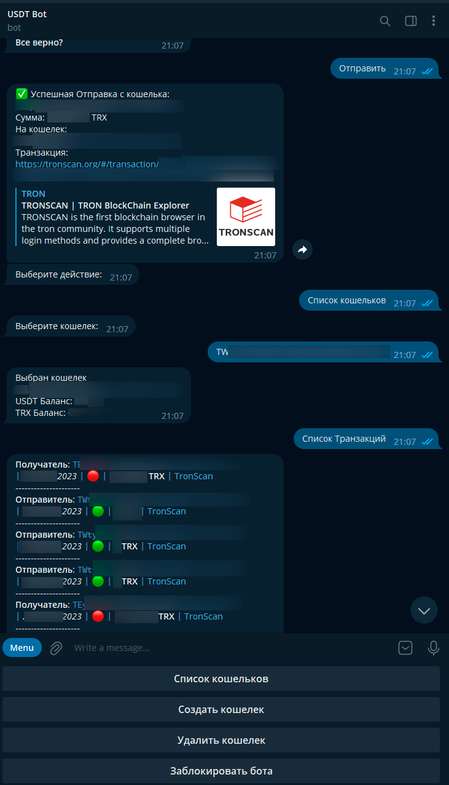

# :moneybag: TELEGRAM USDT/TRX Бот на сети TRON :moneybag:



## Что умеет этот бот?
1. :sunglasses: Зашифрованно хранит все ваши ключ от кошельков методом AES-256-CBC.
2. :open_mouth: Создает новый кошелек в 1 Клик.
3. :triumph: Просмотр списка транзакций.
4. :smiley_cat: Отправка USDT на любой кошелек.
5. :smile_cat: Отправка TRX на любой кошелек.
6. :scream_cat: Возможность удалять кошельки.
7. :eyes: Получение актуального баланса кошелька в USDT+TRX при выборе кошелька.
8. :muscle: Заблокировать бота в любой момент (потребуется ввести заного ключ шифрования).

# Установка и запуск

### 1. Создать Бота в телеграме и получить token вашего бота
```
https://t.me/BotFather
```
### 2. Заменить переменные в файле tronbot.js
```
const token = '<ваш ключ>'; // Ключ Телеграм Бота
let secretKey = ''; // Ваш Секретный ключ шифрования Файла [Запомните его! Вы можете записать его прямо тут или же отправлять в сообщении при первом 
запуске программы].
```
### 3. Запуск скрипта
```
node tronbot.js
```

### Бот работает по типу polling, вам не нужно устанавливать на бота WebHook.

